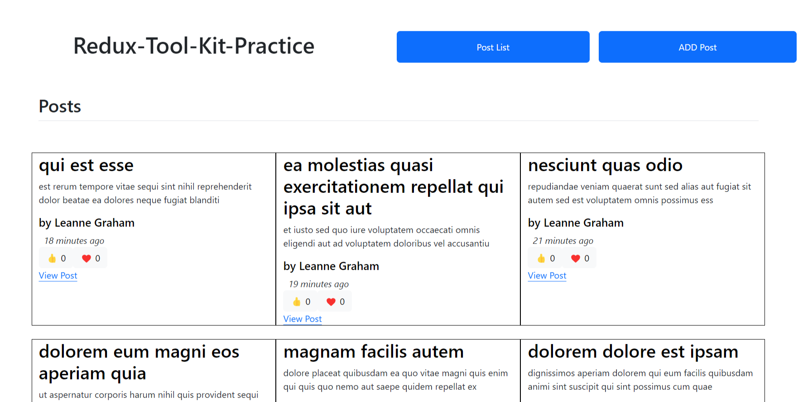
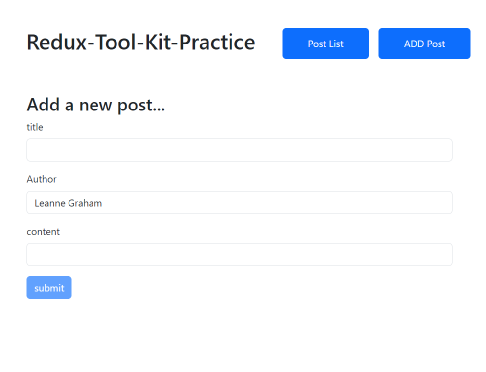
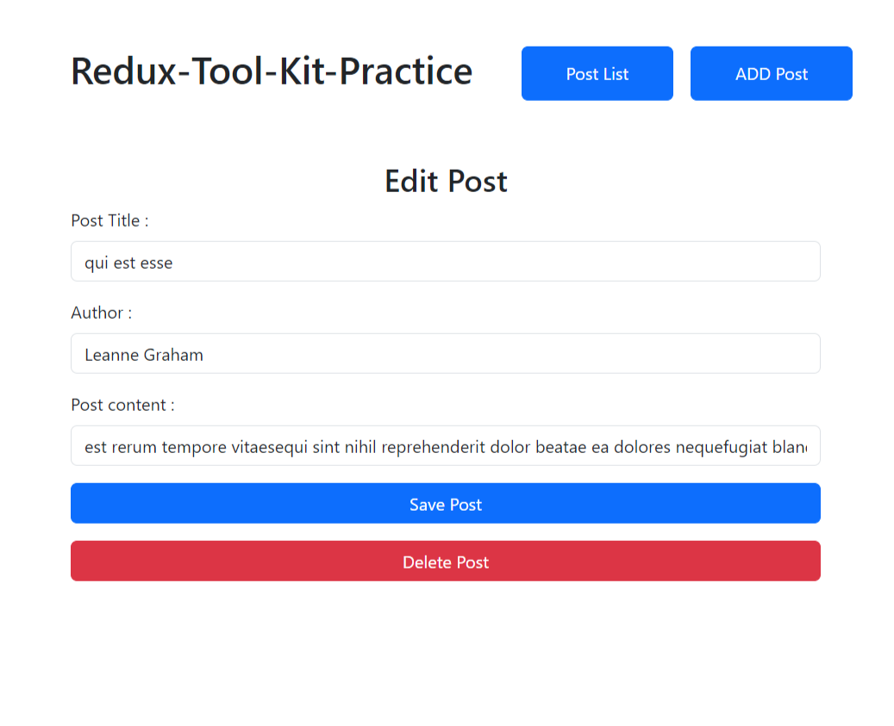
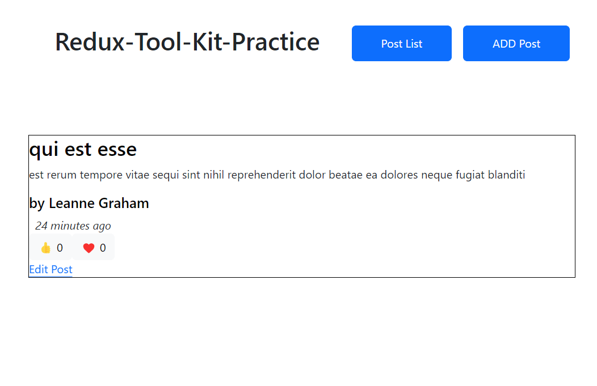

# REDUX-TOOL-KIT LEARN

*This app was built to get understanding of redux-tool-kit for react.*
*This is a blog post react app where anyone can read posts, add a post ,delete a post and give reactions to post.*
### Concepts-used
  - JSON Placeholder for backend REST operations
  - CRUD using redux

### ScreenShots

##### Index

##### AddPost

##### EditPost

##### ViewPost

